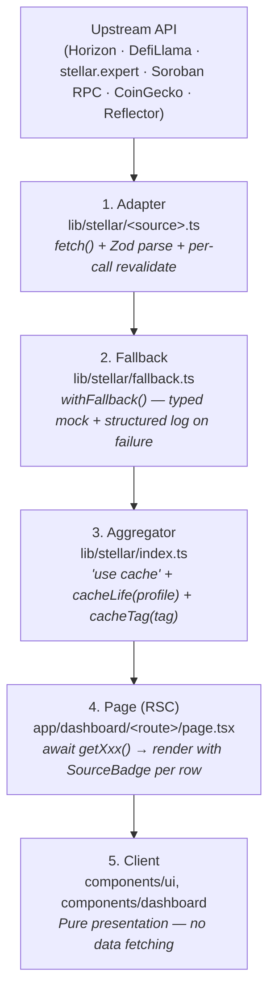

<div align="center">

# Stellar Pulse

**The provenance-first analytics layer for the Stellar economy.**

TVL · stablecoins · capital flows · RWAs · Soroban activity · a 0–100 trust score — every number badged with its upstream source, every adapter validated by Zod, every failure logged.

[]()
[]()
[]()
[]()
[]()
[]()
[](https://stellar.org)
[](https://soroban.stellar.org)
[]()

</div>

---

## The problem

Stellar's analytics surface is **fragmented**. To understand what's happening on the network today, an analyst, builder, or investor has to stitch together at least five tools:

- **Horizon explorer** for stablecoin supply and payments.
- **stellar.expert** for Soroban contract activity.
- **DefiLlama** for TVL by protocol.
- **CoinGecko / Reflector** for prices.
- **A spreadsheet** to reconcile RWAs, yields, capital flows, and trust signals.

There is no single view of the Stellar economy that an end user can trust at a glance — and worse, the dashboards that *do* exist often surface unverified or stale numbers without saying so.

## What Stellar Pulse does

Stellar Pulse is a **server-rendered, open-source analytics dashboard** that unifies the Stellar economy into one coherent view. Its core commitment:

> **Every number is either verified live data, badged with its source — or marked Illustrative. There is no silent mock data anywhere in the UI.**

Eight pages cover TVL by protocol, stablecoin supply (USDC / EURC / USDT bridged), capital-flow Sankey, tokenized real-world assets (BENJI, WTGXX, ...), Soroban contract activity, layered XLM/USDC price oracle, and a proprietary 0–100 trust score over the top 12 protocols.

## Why it matters for the Stellar ecosystem

| Stakeholder | What they get |
|---|---|
| **Analysts & investors** | A single, trustworthy view of where capital sits on Stellar and how it moves — with row-level provenance so claims can be cited. |
| **Protocol builders** | A standard surface to be discovered on, with a transparent trust-score methodology they can engineer toward. |
| **Stellar Development Foundation** | Independent observability on RWAs, stablecoin growth, Soroban adoption, and TVL — useful for ecosystem reporting and grant evaluation. |
| **End users (newcomers)** | A way to evaluate Stellar protocols without needing to read four explorers. |

## Table of contents

- [Quick links](#quick-links)
- [Quick start](#quick-start)
- [How it works](#how-it-works)
- [Built on Stellar](#built-on-stellar)
- [Pulse Score methodology](#pulse-score-methodology)
- [Caching, freshness, observability](#caching-freshness-observability)
- [Security model](#security-model)
- [Roadmap](#roadmap)
- [Project layout](#project-layout)
- [Scripts](#scripts)
- [Deployment](#deployment)
- [Documentation](#documentation)
- [Contributing](#contributing)
- [License & credits](#license--credits)

## Quick links

| | |
|---|---|
| Live demo | _Deployed after SCF review_ — `npm run dev` for local |
| Architecture spec | [`docs/data-architecture.md`](docs/data-architecture.md) |
| Security playbook | [`SECURITY.md`](SECURITY.md) |
| Ship plan & retros | [`docs/ship-plan.md`](docs/ship-plan.md) |
| Issues / discussion | GitHub Issues on this repo |

## Quick start

```bash
git clone https://github.com/Lucasalb11/Stellar-pulse.git
cd Stellar-pulse
npm install
npm run dev
```

Open [http://localhost:3000](http://localhost:3000). **No API keys required** for v1 — every upstream is a free public endpoint.

Optional env vars (see [`docs/getting-started/configuration`](docs/getting-started/configuration.md)):

| Var | Purpose |
|---|---|
| `COINGECKO_API_KEY` | Lifts the price oracle's rate-limit ceiling |
| `REVALIDATE_SECRET` | Required to expose `POST /api/revalidate` |

## What it shows

| Route | Page | Stellar/DeFi sources |
|---|---|---|
| `/` | Landing — hero KPIs, live XLM ticker, narrative blocks | DefiLlama, CoinGecko / Reflector |
| `/dashboard` | Overview — TVL by category, top protocols, recent activity | DefiLlama |
| `/dashboard/protocols` | All Stellar DeFi protocols ranked by TVL | DefiLlama |
| `/dashboard/defi` | Protocol + yield-pool tables with verified outbound links | DefiLlama, DefiLlama Yields |
| `/dashboard/stablecoins` | USDC / EURC / USDT supply on Stellar | **Horizon** |
| `/dashboard/flows` | Sankey of capital flow between known entities | **Horizon** (payments) |
| `/dashboard/rwa` | Tokenized treasuries & funds (BENJI, WTGXX, ...) | **Horizon** + issuer registry |
| `/dashboard/soroban` | Top contracts by activity score, KPI rollups | **stellar.expert**, **Soroban RPC** |
| `/dashboard/pulse-score` | 0–100 trust score over the top 12 protocols | derived from DefiLlama |

Every row deeper than `/dashboard` carries a `<SourceBadge>` — accent color = verified, warning color = Illustrative fallback. Hover for source / verified / as-of metadata.

## How it works

The system is a **5-layer pipeline** from public endpoint to rendered cell. Each layer has exactly one job; layers don't skip.



**Layer 1 — Adapter.** One file per upstream URL. Zod parses every response. If `horizon.stellar.org` appears in two files, that's a bug.

**Layer 2 — Fallback.** `withFallback(fn, mock, tag)` returns a typed Illustrative value on any failure and emits exactly one structured log: `[stellar] <tag> failed, using fallback: <error>`. A slow DefiLlama response never blocks the page — but ops always knows.

**Layer 3 — Aggregator.** `'use cache'` lives on the aggregator, not the page — page-level caching would invalidate too coarsely. Each aggregator picks a `cacheLife` profile and a `cacheTag` so `POST /api/revalidate` can purge selectively.

**Layer 4 — Page.** Async Server Components await aggregator functions. They never call `fetch` directly.

**Layer 5 — Client.** Pure presentation. Receives typed props. Owns no Stellar state.

### Worked example — the layered XLM/USDC oracle

```
CoinGecko spot  →  Reflector (Soroban oracle)  →  Horizon orderbook mid  →  last good cache
```

Each step has its own adapter + Zod schema. A `0.95–1.05` USDC peg sanity band rejects obviously wrong prices before they reach a page. The `SourceBadge` in the UI surfaces which step produced the number — e.g. `COINGECKO` vs `ORDERBOOK`.

Full architecture spec: [`docs/architecture/overview`](docs/architecture/overview.md).

## Built on Stellar

Stellar Pulse is **not a generic blockchain dashboard.** Its core data comes from Stellar-native sources, and several features only make sense on Stellar:

| Capability | How it uses Stellar specifically |
|---|---|
| **Stablecoin supply** | Reads `balances.authorized + liquidity_pools_amount + contracts_amount + claimable_balances_amount` from Horizon `/assets` — fields that only exist because Stellar tracks issued-asset balances natively. |
| **RWA tracking** | Issuers are keyed by Stellar `G…` account IDs. Categories (Treasuries / Funds / Bonds / Private Credit) reflect Stellar's strength as the RWA chain. |
| **Capital-flow Sankey** | Aggregates Horizon `/payments`. Sankey nodes are real Stellar accounts from a `directory.ts` map of known entities (Circle USDC, Allbridge, ...). |
| **Soroban contracts** | Top contracts come from `stellar.expert /explorer/public/contract`. Activity score blends `invocations + subinvocation + payments + events` because the public unauthenticated endpoint doesn't pre-sort. |
| **Soroban RPC** | Drives the Reflector oracle path in the price chain. |
| **Asset registry** | Keyed by `{code, issuer}` tuple — the **only** correct way to identify a Stellar asset (issuer disambiguates collision-prone codes like USDT). |
| **Protocol-link registry** | Zod-validated outbound links to Soroswap, Blend, Aquarius, Phoenix, StellarX, Lumen Bridge — every link `rel="noopener noreferrer"`, `https`-only, no `javascript:` / `data:`. |

The application reads only **public mainnet endpoints** owned by the Stellar Foundation (Horizon, Soroban RPC), the community (stellar.expert), and aggregators (DefiLlama, CoinGecko). No private API keys are required to evaluate it.

## Pulse Score methodology

`/dashboard/pulse-score` ranks the top 12 Stellar DeFi protocols on a 0–100 scale. The formula is **transparent and deterministic**:

```
score = 0.35 · liquidity
      + 0.30 · tvlStability
      + 0.15 · age
      + 0.20 · concentration
```

| Factor | Source | Notes |
|---|---|---|
| **liquidity** (35%) | DefiLlama TVL rank | Normalized 0–100 across the protocol set |
| **tvlStability** (30%) | DefiLlama 30-day TVL series | `100 - stdDev(daily % change)` clamped to 0–100 |
| **age** (15%) | Internal `KNOWN_AGE_HINT` map | Hardcoded launch hints today; v2 → on-chain inception |
| **concentration** (20%) | Defaults to 70 in v1 | v2 → Horizon `top-holders` Herfindahl index |

Verdict bands: **Trusted ≥ 85**, **Solid ≥ 70**, **Watch ≥ 55**, otherwise **Risky**.

**Honest v1 caveats**, documented inline:
- `tvlStability` uses the chain-level TVL series because DefiLlama doesn't expose per-protocol historical series for every Stellar protocol — v2 differentiates per-protocol.
- `concentration` is a stable default until Horizon `top-holders` is wired in v2.

Source: [`lib/stellar/pulse-score.ts`](lib/stellar/pulse-score.ts). Reference doc: [`docs/dashboards/pulse-score`](docs/dashboards/pulse-score.md).

## Data sources

| Source | Used for | Auth | Notes |
|---|---|---|---|
| [Horizon](https://horizon.stellar.org) | Stablecoin supply, payments, orderbook | None | Stellar Foundation public node |
| [Soroban RPC](https://soroban-rpc.mainnet.stellar.gateway.fm) | Contract events, Reflector oracle | None | Public mainnet endpoint |
| [stellar.expert](https://api.stellar.expert/explorer/public/) | Top contracts, directory, asset metadata | None | ~30 req/min unauthenticated |
| [DefiLlama](https://api.llama.fi) | TVL by protocol/category, historical series | None | Powers `/dashboard/defi`, `/protocols`, Pulse Score |
| [DefiLlama Yields](https://yields.llama.fi) | APY pools | None | Caps APY at 500% (sanity ceiling) |
| [CoinGecko](https://api.coingecko.com/api/v3) | XLM/USDC spot prices | Optional key | Demo key strongly recommended |
| [Reflector](https://reflector.network) | Soroban-native price oracle | None | Used as fallback under CoinGecko |

Every host listed above also appears in `EXTERNAL_HOSTS` (`lib/stellar/env.ts`). `scripts/security-check.ts` asserts that no `fetch()` in `lib/stellar/*` targets a host outside that allowlist, and that the CSP `connect-src` is a superset of it.

## Caching, freshness, observability

`cacheLife` profiles are defined in `next.config.ts` and consumed by aggregators:

| Profile | `stale` | `revalidate` | Used for |
|---|---|---|---|
| `market` | 1 min | 5 min | Prices, stablecoin supply, payment flows |
| `tvl` | 5 min | 30 min | DefiLlama TVL, contract counts, Pulse Score |

- **`GET /api/health/sources`** returns per-source `verified`/`asOf`/`age` for monitoring. At v0.1 it reports 7/7 sources verified.
- **`POST /api/revalidate`** (gated by `REVALIDATE_SECRET`) invalidates by tag — constant-time auth, allowlist, 10/min IP rate limit. Refuses to operate (503) if the secret is unset.
- **`withFallback`** emits a single structured log line every time it activates, with the failed source tag and the upstream error message. **Degradation is never silent.**

## Security model

`SECURITY.md` is the operational playbook (weekly / monthly / quarterly / pre-deploy / incident-response sections). The code-level controls behind it:

- **`proxy.ts`** sets CSP (with `connect-src` derived from `EXTERNAL_HOSTS`), HSTS, X-Frame-Options `DENY`, X-Content-Type-Options `nosniff`, Referrer-Policy, COOP, CORP, and Permissions-Policy on every response.
- **`POST /api/revalidate`** uses constant-time secret comparison, a tag allowlist, and a 10-req/min IP-keyed rate limiter.
- **`scripts/security-check.ts`** runs in CI and asserts:
  - Protocol-link registry is `https`-only, has no userinfo, rejects `javascript:` / `data:`.
  - Asset registry rows match `^G…` (issuer) and `^C…` (contract) prefixes.
  - Every `fetch()` in `lib/stellar/*` targets `EXTERNAL_HOSTS`.
  - CSP `connect-src` ⊇ `EXTERNAL_HOSTS`.
  - `process.env.REVALIDATE_SECRET` is only read inside `lib/stellar/env.ts`.

At v0.1: **190/190 tests green**, **security-check 0 issues**, **`SECURITY.md` §6 pre-deploy checklist** signed off in the changelog.

## Roadmap

### v0.1 — shipped (current)

- 9 routes live on public endpoints (no keys required to evaluate).
- 7 Stellar / DeFi sources with Zod-validated adapters.
- `withFallback` observability across every adapter.
- Hardened `POST /api/revalidate` + `GET /api/health/sources`.
- CSP / HSTS / X-Frame headers in `proxy.ts`.
- Asset registry keyed by `{code, issuer}`, protocol-link registry, RWA issuer registry.
- Pulse Score v1 computed from live DefiLlama inputs.
- 190 tests · 0 security-check issues · `SECURITY.md` §6 dry-run signed off.

### v0.2 — next quarter

- Wire **Reflector** Soroban-SDK reader (today a stub that throws — chain falls back to orderbook).
- Promote **stellar.expert authenticated** endpoint for proper contract ranking (today the public endpoint reports null `invocations` for most contracts).
- Confirm RWA placeholder issuer keys (`BENJI`, `WTGXX`, Etherfuse) against on-chain issuance.
- Expand Sankey directory with CEX deposit accounts, Soroswap router, Blend pool factory.
- Per-protocol historical TVL series → real differentiation in `tvlStability`.
- Horizon `top-holders` → real `concentration` factor.

### v1 — community feedback dependent

- Public REST API for downstream tools.
- Webhooks for protocols to be notified of score changes.
- Historical snapshots / time-travel.
- Per-asset deep pages (trustlines, payment volume, holder distribution).
- Optional Vercel Postgres / Marketplace DB for snapshot history.

## Project layout

```
stellarPulse/
├── app/                       # Next.js App Router
│   ├── page.tsx               # Landing (marketing + hero KPIs)
│   ├── dashboard/             # Dashboard routes (8 pages)
│   └── api/
│       ├── health/sources/    # GET — per-source freshness
│       └── revalidate/        # POST — tag invalidation (gated)
├── lib/
│   ├── types.ts               # Shared type contracts
│   ├── mock-data.ts           # Typed fallback layer (verified: false)
│   └── stellar/               # Source adapters (one file per upstream)
│       ├── index.ts           #  └─ Aggregators consumed by pages
│       ├── horizon.ts
│       ├── stellar-expert.ts
│       ├── defillama.ts
│       ├── defillama-yields.ts
│       ├── soroban.ts
│       ├── prices/            #     CoinGecko → Reflector → orderbook chain
│       ├── pulse-score.ts
│       ├── sankey.ts          #     Flow aggregator (40% threshold, edge cap)
│       ├── assets.ts          #     Registry keyed by {code, issuer}
│       ├── protocol-links.ts  #     Validated outbound-link registry
│       ├── rwa.ts             #     Verified RWA issuer registry
│       ├── cache.ts           #     cacheLife profiles + tag constants
│       ├── fallback.ts        #     withFallback() observability wrapper
│       └── schemas.ts         #     Shared Zod primitives
├── components/
│   ├── ui/                    # KPI, Badge, SourceBadge, chart wrappers
│   ├── dashboard/             # Topbar, charts, Sankey, layout
│   └── landing/               # Hero, nav, network background
├── tests/                     # vitest specs (mirrors lib/ — 190 tests, 23 files)
├── scripts/security-check.ts  # Static security guard (CI gate)
├── proxy.ts                   # Routing middleware (CSP + HSTS + headers)
├── docs/                      # Docusaurus-structured documentation (29 pages)
└── SECURITY.md                # Operational security playbook
```

## Scripts

| Command | What it does |
|---|---|
| `npm run dev` | Next dev server on `:3000` (Turbopack) |
| `npm run build` | Production build |
| `npm run start` | Serve production build |
| `npm test` | Full vitest suite (190 tests across 23 files) |
| `npm run test:watch` | Vitest watch mode |
| `npm run test:coverage` | v8 coverage report |
| `npm run security-check` | Static security guard over `lib/`, `app/`, `components/`, `scripts/` |

## Deployment

Stellar Pulse is built for Vercel. The recommended path:

1. Push to your Vercel-linked repo.
2. Set production env vars (`REVALIDATE_SECRET` required to expose revalidation; `COINGECKO_API_KEY` recommended).
3. Run the [pre-deploy checklist](SECURITY.md) (`SECURITY.md` §6).
4. Promote.

Full walkthrough: [`docs/guides/deployment`](docs/guides/deployment.md).

## Documentation

Docs live in [`docs/`](docs/intro.md) and follow Docusaurus conventions (front-matter `sidebar_position`, `_category_.json` per section).

| Section | Contents |
|---|---|
| [Intro](docs/intro.md) | What Stellar Pulse is, design principles, where to go next |
| [Getting Started](docs/getting-started/installation.md) | Install, configure, first dev session |
| [Architecture](docs/architecture/overview.md) | The 5-layer pipeline, sources, caching, fallback, types |
| [Dashboards](docs/dashboards/overview.md) | Per-page documentation of every route |
| [API](docs/api/health.md) | `/api/health/sources` and `/api/revalidate` reference |
| [Guides](docs/guides/testing.md) | Testing, security-check, deployment, adding a source |
| [Security](docs/security/overview.md) | Threat model + code-level controls |
| [Reference](docs/reference/types.md) | Type contracts, file map, error codes |

Long-form companion docs at the top of `docs/`:

- [`SECURITY.md`](SECURITY.md) — operational playbook
- [`docs/data-architecture.md`](docs/data-architecture.md) — full architecture spec
- [`docs/ship-plan.md`](docs/ship-plan.md) — Definition of Done + retro log

## Contributing

Stellar Pulse is **open source under MIT** and welcomes contributions from the Stellar community.

- **Issues** — File one for bugs, data-source proposals, or score-methodology suggestions.
- **Pull requests** — All PRs must keep `npm test`, `npm run build`, and `npm run security-check` clean. New data sources must follow [`docs/guides/adding-a-source`](docs/guides/adding-a-source.md): one adapter file, a Zod schema, a parse-failure test, a happy-path test, and inclusion in `EXTERNAL_HOSTS`.
- **Security** — Report sensitive issues privately to the maintainer. See [`SECURITY.md`](SECURITY.md).

## License & credits

**MIT.** See [`LICENSE`](LICENSE) when published; license terms also in `package.json`.

Built on top of work by the **Stellar Development Foundation** (Horizon, Soroban RPC), **stellar.expert** (explorer + directory), **DefiLlama** (TVL + yields), **CoinGecko** (prices), and **Reflector** (Soroban oracle). Stellar Pulse adds the integration layer, the provenance UI, the trust score, and the security/observability surface.

---

<div align="center">

**Stellar Pulse v0.1 — built for the Stellar Community Fund review.**

</div>
